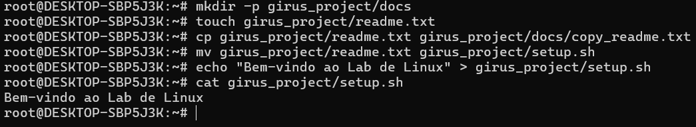
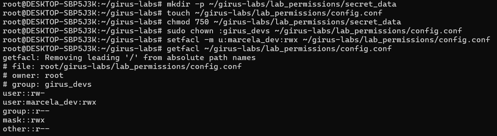
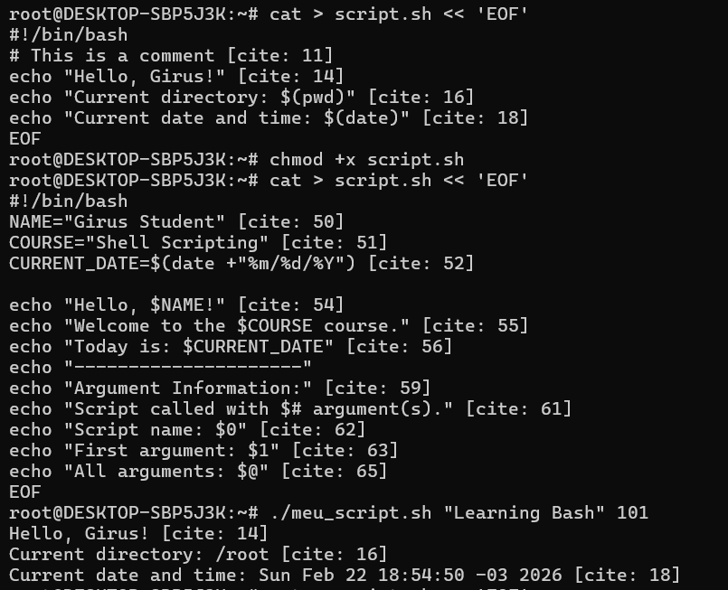
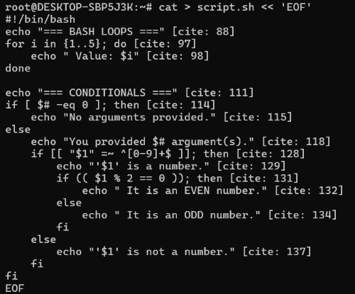
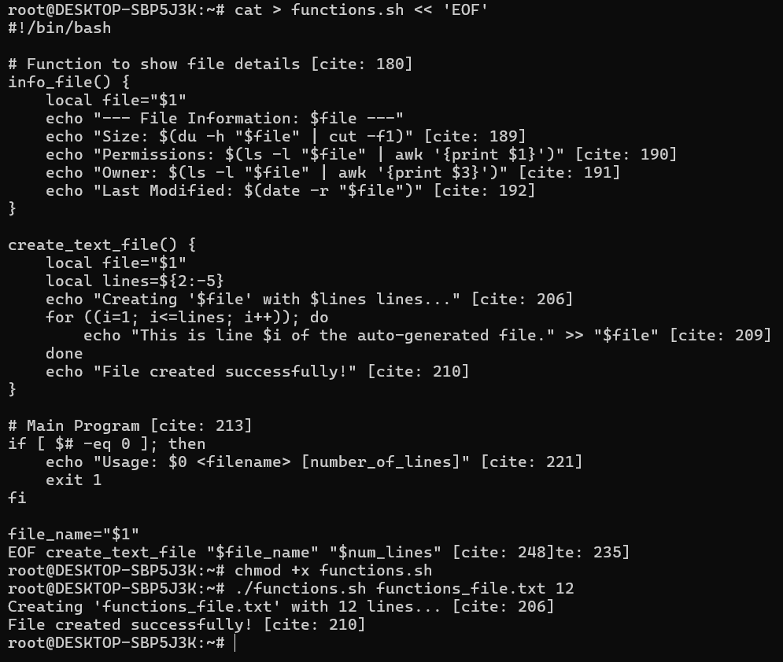

# Girus Labs - Personal Collection 🚀

This repository contains custom interactive laboratories for the **Girus Platform**.

## 📋 Labs Included

### 1. Linux Basic Commands
- **Description:** Essentials Linux concepts with fundamentals commands.

### 2. Linux Users and Groups Management
- **Description:** Identity management fundamentals on Linux, including creation of user accounts, groups, and directory-level permission policies.

### 3. File Permissions and Security (ACLs)
- **Description:** Advanced file system security using traditional octal permissions and Access Control Lists (ACLs) for granular management.

### Lab 4: Bash Shell Scripting
- **Description:** Automating tasks using Bash Shell Scripting within a Linux environment.

*Initial script creation and execution*

*Using variables, arguments, and loops*

*Advanced file manipulation using functions*
